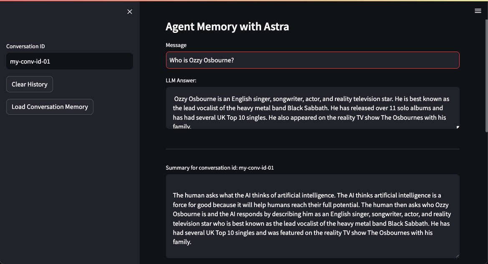

# Astra Agent Memory

## Installing dependencies

pip install -r requirements.txt

## Environment Variables

Define the AstraDB credentials and Open AI API Key in the .env file.

Copy .env.sample to .env

## Running

streamlit run app.py

